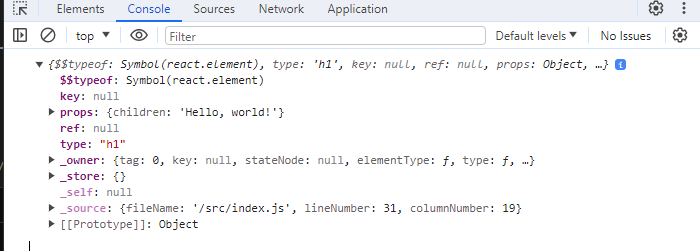
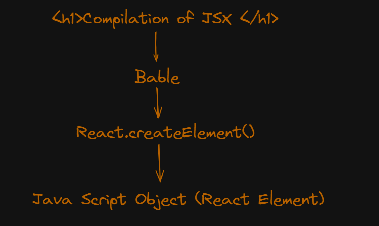

# JSX

- Java Script XML
- Java Script Syntax eXtension (formally)
- JS extension that allow creation of `Document Object Model (DOM)` trees using XML like syntax.
- created by `Facebook` for use with `React`
- `Syntactic sugar`, JSX is `transpiled` into `nested JS` function calls

> const heading = \<h1>JSX element\</h1>

## Things to understand while working with JSX

### Multi line JSX

- Wrap the element in parentheses `()` to avoid the pitfalls of `automatic semicolon insertion`

```
  const heading = (
    <h1>
      Hello, world!
    </h1>
  );
```

### Nested Elements

- Multiple elements at same level must be `wrapped` inside single React element like `<div>` or `<Fragment>` or `<></>`

  - ```js
    const App = () => {
      return (
        <div>
          <p>Header</p>
          <p>Content</p>
          <p>Footer</p>
        </div>
      );
    };
    ```

### Attributes

- use to pass data to component
- we can pass custom attributes also
- all attributes received by component as `props`
- use `quotes` (for string values) or `curly braces` (for expressions),

  - ```js
    const MyComponent = (props) => {
      return <>I got the props {props.name}</>;
    };

    <MyComponent name="shubham" age={caculateAge(user.dob)} />;
    ```

#### Attributes naming conventions

- React DOM uses `camelCase` property naming convention

```js
<h1 className="h-10 w-20"></h1>
```

### Java Script Expressions

- Java Script `expressions` but not the `statements` can be used inside JSX with `curly brackets` `{}`

```js
<h1>{5+5}</h1>

// above element would be render as
<h1>11</h1>

```

```js
<h2>{console.log("We also can log, isn't it cool! ")}</h2>

<h3>{(console.log("hello"), console.log("second line"))}</h3>

<div> {(() => console.log(8))()}</div>
// above example log into console
```

#### Note: Whatever the `piece of code` you write inside `{}` in JSX , should be `resolved` to be an `expression`.

### Conditional Expressions

- we can't use `if-else` statements inside JSX.
- Instead use `Conditional Expressions`

```js
<h1> {userId === 5 ? "valid" : "invalid"} </h1>
```

## Transpilation/Compilation of JSX

- After compilation, `JSX` expressions become regular `JavaScript function calls` (`React.createElement()`) and evaluate to `JavaScript objects`.
- `JSX` code will be transpiled to `JS objects`

```js
const root = <h1>Hello, world!</h1>;
console.log(root);
```



### Fun Fact !!!

#### What is Virtual DOM look like and where is it!?

- The JS `Object` inside Above Screenshot is noting but `Virtual DOM` !!!!

- React will store the copy of JS object got from `<APP/>` or root elemet somewhere inside memory.

## JSX prevents Injection Attacks

React DOM `escapes`any values `embedded inside` JSX befor `rendering` them

- `escapes`: Replacing any characters that have special meaning in HTML with their corresponding escape sequences

  - `<` becomes `&lt;`
  - `"` becomes `&quot;`

Ensures that you can never inject anything, which is not part of your application.

`Everything` is converted to a `string` before being `rendered`

- Prevent `XSS (cross-site-scripting)` attacks.

## JSX represents Objects

#### `Babel` compiles JSX down to `React.createElement()` calls.

```
const element = (
  <h1 className="greeting">
    Hello, world!
  </h1>
);
```

#### `Bable` compiles above `JSX` to below `React.createElement()`

```
const element = React.createElement(
  'h1',
  {className: 'greeting'},
  'Hello, world!'
);
```

#### `React.createElement()` creates an `JS object`

```js
// Note: this structure is simplified
// see the section  Transpilation/Compilation of JSX
const element = {
  type: "h1",
  props: {
    className: "greeting",
    children: "Hello, world!",
  },
};
```

> These objects are called `“React elements”`

### At the end of day `JSX` is converted to `JS Object`



### Booleans, Null, and Undefined Are Ignored

```js
// all below will produce same o/p
// nothing will be printed on screen
<div />

<div></div>

<div>{false}</div>

<div>{null}</div>

<div>{undefined}</div>

<div>{true}</div>
```

## Resource links:

- [JSX (JavaScript) - Wikipedia](<https://en.wikipedia.org/wiki/JSX_(JavaScript)#:~:text=Initially%20created%20by%20Facebook%20for,similar%20to%20the%20original%20JSX.>)

- [React Dev JSX](https://react.dev/learn/writing-markup-with-jsx)
